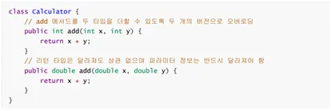
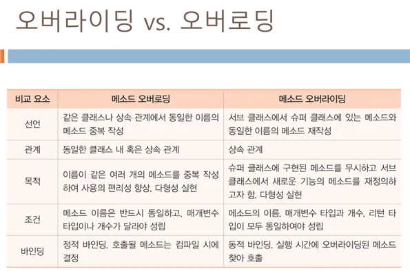
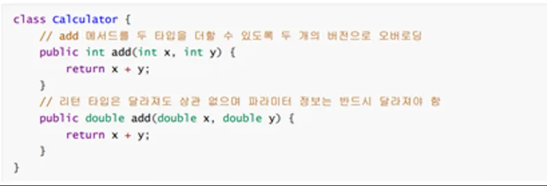

> 메소드 오버라이딩
> 
- 슈퍼 클래스의 메소드를 서브 클래스에서 재정의하는 것 =>객체지향의 다형성 실현
- 기본적으로 한 클래스 내에 같은 이름의 메소드를 둘 이상 가질 수 없지만, 매개변수의 개수나 타입 혹은 순서를 다르게 하면 같은 이름의 메소드를 여러개 작성할 수 있다.
- 단, 다음과 같이 메서드 반환 타입만 다르게 메서드 오버로딩은 불가능
- 동적 바인딩이 발생한다.(서브 클래스에 오버라이딩된 메소드가 무조건 실행된다.)



```
package _06MethodOverRiding;
/*정적 바인딩 *//*
super는 슈퍼 클래스의 멤버를 접근할 때 사용되는 레퍼런스
서브 클래스에서만 사용
슈퍼 클래스의 메소드 호출
컴파일러는 super의 접근을 정적 바인딩으로 처리
* */class Shape3{ //슈퍼 클래스//Circle이 여기로 들어가고protected String name; //같은 패키지에 존재하는 클래스 혹은 해당 클래스를 상속 받는 자식 클래스에서만 접근public void paint(){ //메소드 paint
        draw(); //draw메소드 호출
    }
    public void draw(){ //draw메소드
        System.out.println(name); //name출력 (앞에서 같은 패키지에 존재하는 클래스 혹은 해당 클래스를 상속 받는 자식 클래스에서만 접근 할 수 있는 변수)
    } //Circle 출력 하고
}
//서브 클래스 (상속) - 오버로드public class Circle3 extends Shape3{
    protected String name; //같은 패키지에 존재하는 클래스 혹은 해당 클래스를 상속 받는 자식 클래스에서만 접근 가능@Override //상속public void draw(){

        super.name="Shape"; //super.name을 Shape로 줌
        name="Circle"; //name을 Circle로 줌super.draw(); //정적 바인딩
        System.out.println(name);
    }

    public static void main(String[] args) {
        Shape3 b=new Circle3();
        b.paint();
    }

}

package _06MethodOverRiding;
/*메소드 오버라이딩

         -슈퍼클래스의 메소드를 서브 클래스에서 재정의하는 것 =>객체지향의 다형성 실현
        - 기본적으로 한 클래스 내에 같은 이름의 메소드를 둘 이상 가질 수 없지만, 매개변수의 개수나 타입 혹은 순서를 다르게 하면 같은 이름의 메소드를 여러개 작성할 수 있다.
        - 단, 다음과 같이 메서드 반환 타입만 다르게 메서드 오버로딩은 불가능
        - 동적 바인딩이 발생한다.(서브 클래스에 오버라이딩된 메소드가 무조건 실행된다.) */class Shape{ //슈퍼 클래스 Shapepublic Shape next; //멤버 변수 nextpublic Shape(){next=null;} //Shape메소드(슈퍼 클래스의 메소드)public void draw(){
        System.out.println("Shape");
    } //draw메소드(슈퍼클래스의 메소드)
}
class Line extends Shape{ //Line 서브 클래스1public void draw(){
        System.out.println("Line");
    } //draw 메소드 재정의
}
class Rect extends Shape{ //Rect 서브 클래스2public void draw(){
        System.out.println("Rect");
    } //draw메소드 재정의
}
class Circle extends Shape{ //Circle 서브 클래스3public void draw(){
        System.out.println("Circle");
    }//draw 메소드 재정의
}
public class MethodOverridingEx { //mainpublic static void paint(Shape p){
        p.draw(); //p가 가리키는 객체 내에 오버라이딩된 draw()호출 (동적 바인딩)
    } //static 메소드(앞의 public 은 붙인 것)Spublic static void main(String[] args) {
        Line line=new Line();//Line 객체 생성
        paint(line); //Shape의 멤버에서 Line의 멤버로 동적 바인딩(실행 이후에 런타임에 호출될 함수가 결정되는 것)  =>결괏값 line
        paint(new Shape()); //Shape객체 생성 => class Shape 실행 => Shape
        paint(new Line()); //Line 객체 생성=> class Line 실행=>Line
        paint(new Rect()); //Rect객체 생성=> class Rect 실행=> Rect
        paint(new Circle()); //Circle 객체 생성=>class Circle=> Circle
    }
}

package _06MethodOverRiding;
/*
* 동적 바인딩
* - 실행할 메소드를 실행중에 결정'
* -오버라이딩 메소드가 항상 호출
* */class shape5{
    protected String name;
    public void paint(){
        draw(); //draw메소드 호출
    }
    public void draw(){ //동적 바인딩이 일어남
        System.out.println("Shape");
    }
}
public class Circle4 extends shape5{
    @Override
    public void draw(){
        System.out.println("Circle");
    }

    public static void main(String[] args) {
        shape5 b = new Circle4();
        b.paint(); //메소드 오버라이딩, paint 메소드 호출
    }

}

package _06MethodOverRiding;
/*게임에서 무기를 표현하는 Weapon클래스를 만들고 살상 능력을 리턴하는 fire()메소드는 다음과
* 같다. fire()은 1을 리턴한다. (뭐 이런 무서운 코드가 다있냐 */class Weapon {
    protected int fire(){
        return 1; //무기는 기본적으로 한명만 살상
    }
}
class Cannon extends Weapon{
    @Override
    protected int fire(){ //오버라이딩return 10; //대포는 한 번에 10명을 살상
    }
}
/*대포를 구현하기 위해 Weapon을 상속받는 Cannon 클래스를 작성하라.Cannon은 살상능력이 10이다.
fire()메소드를 이에 맞게 오버라이딩하라. main()을 작성하여 오버라이딩을 테스트 하라.
* */public class Overriding {
    public static void main(String[] args) {
        Weapon weapon;
        weapon=new Weapon();
        System.out.println("기본 무기의 살상 능력은 "+weapon.fire());
        weapon =new Cannon();
        System.out.println("대포의 살상 능력은 "+ weapon.fire());
    }
}
/*
{ 오버라이딩 }
- 같은 이름의 메소드를 중복하여 정의하는 것=> 객체 지향의 다형성 실현
- 기본적으로 한 클래스 내에 같은 이름의 메소드를 둘 이상 가질 수 없지만, 매개변수의 개수나 타입 혹은
순서를 다르게 하면 같은 이름의 메소드를 여러개 작성할 수 있다.
-동적 바인딩이 발생한다. (서브 클래스에 오버라이딩된 메소드가 무조건 실행된다.)

오버라이딩과 오버로딩의 차이
<메소드 오버라이딩>
-선언 : 서브 클래스에서 슈퍼클래스에 있는 메소드와 동일한 이름의 메소드 재작성
-관계 : 상속관계
-목적 : 슈퍼 클래스에 구현된 메소드를 무시하고 서브 클래스에서 새로운 기능의 메소드를 재정의하고자 함=>다형성 실현
-조건 : 메소드의 이름, 매개변수 타입과 개수, 리턴 타입이 모두 동일하여야 성립
-바인딩 : 동적 바인딩, 실행 시간에 오버라이딩 된 메소드를 찾아 호출

<메소드 오버로딩>
-선언 : 같은 클래스나 상속관계에서 동일한 이름의 메소드 중복 작성
-관계 : 동일한 클래스 내 혹은 상속 관계
-목적 : 이름이 같은 여러 개의 메소드를 중복 작성하여 사용의 편리성 향상=>다형성 실현
-조건 : 메소드 이름은 반드시 동일하고, 매개변수 타입이나 개수가 달라야 성립
-바인딩 : 정적 바인딩, 호출될 메소드는 컴파일 시에 결정
*/

package _06MethodOverRiding;
/*오버라이딩
* -슈퍼 클래스의 메소드를 서브 클래스에서 재정의 하는 것=>객체지향의 다형성
* -기본적으로 한 클래스 내에 같은 이름의 메소드를 둘 이상 가질 수 없지만, 매개변수의 개수나 타입, 순서를 다
* 다르게 하면 같은 이름의 메소드를 여러개 작성할 수 있다.
* -동적 바인딩이 발생한다. (서브 클래스에 오버라이딩 된 메소드가 무조건 실행된다.)
* -단 다음과 같이 메소드 반환 타입만 다르게 메소드 오버로딩은 불가능하다.  */class Shape2{ //슈퍼 클래스 Shapepublic Shape2 next; //멤버 변수 nextpublic Shape2(){next=null;} //Shape메소드(슈퍼 클래스의 메소드)public void draw(){
        System.out.println("Shape");
    } //draw메소드(슈퍼클래스의 메소드)
}
class Line2 extends Shape{ //Line 서브 클래스1public void draw(){
        System.out.println("Line");
    } //draw 메소드 재정의(메소드 오버라이딩)
}
class Rect2 extends Shape{ //Rect 서브 클래스2public void draw(){
        System.out.println("Rect");
    } //draw메소드 재정의(메소드 오버라이딩)
}
class Circle2 extends Shape{ //Circle 서브 클래스3public void draw(){
        System.out.println("Circle");
    }//draw 메소드 재정의(메소드오버라이딩)
}
public class UsingOverride {
    public static void main(String[] args) {
        Shape start, last,obj;
        //링크리스트로 도형 생성하여 연결
        start = new Line2();//Line 객체 연결 (Line)
        last = start; //Shape타입 start
        obj=new Rect2(); //Shape타입 obj에 Rect 객체 생성(Rect)
        last.next=obj; //Line객체에 Rect객체 연결
        last=obj;
        obj=new Line2(); //Line객체 생성
        last.next=obj; //Line객체를 Rect에 연결
        last=obj;
        obj=new Circle2(); //Circle객체 생성
        last.next=obj; //Line객체에 Circle연결
        Shape p=start; //변수 p는 start를 가리킨다.while(p!=null){ //p가 null이 아닌 경우 (하지만 p는 null이다. 앞에서 shape으로 객체를 생성했기 때문)
            p.draw(); //p.draw ->따라서 해당되지 않는다.
            p=p.next;
        }
    }
}
```


