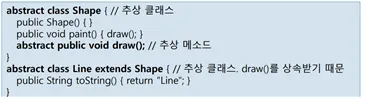
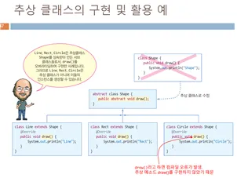

# 추상클래스와 인터페이스

> 추상클래스(abstract class)
> 

1) 추상메소드를 하나라도 가진 클래스

2) 추상메소드가 없지만 abstract로 선언된 클래스

3) 객체를 생성할 수 없다.

4) 상속:
    1.단순상속 :추상클래스를 상속받아,추상메소드를 구현하지 않으면 추상클래스가 된다.서브 클래스도 abstract로 선언해야 한다.
    2. 추상클래스 구현 상속: 서브 클래스에서 슈퍼 클래스의 추상 메소드를 구현(오버라이딩). 이때 서브 클래스는 추상클래스가 아니다.
    
5) 용도 :　-슈퍼 클래스에서는 개념 정의( 서브 클래스마다 다른 구현이 필요한 메소드는 추상메소드로 선언한다. )

- 각 서브 클래스에서 구체적 행위 구현(서브 클래스마다 목적에 맞게 추상 메소드 다르게 구현 한다. )
- 계층적 상속관계를 갖는 클래스 구조를 만들 때 쓰인다.

> 추상메소드(abstract method)
> 
- abstract 키워드를 이용해서 정의한 클래스를 추상클래스라고 한다.
- 구현내용이 없는 메소드
- 서브 클래스에서 오버라이딩하여 구현해야 한다.

```
package _07AbstractMethod;


abstract class Calculator{ //추상 클래스public abstract int add(int a,int b); //추상 메소드public abstract int substract(int a, int b); //추상 메소드public abstract double average(int[]a); //추상메소드
}
public class GoodCalc extends Calculator{ //일반 클래스(서브 클래스) 추상클래스를 상속 받음@Override
    public int add(int a, int b){ //추상 메소드 구현return a+b;
    }
    @Override
    public int substract(int a,int b){ //추상 메소드 구현return a-b;
    }
    @Override
    public double average(int[]a){ //추상메소드 구현double sum=0;
        for(int i=0;i<a.length;i++)
            sum +=a[i];
        return sum/a.length;
    }

    public static void main(String[] args) {
        GoodCalc c = new GoodCalc();
        System.out.println(c.add(2,3));
        System.out.println(c.substract(2,3));
        System.out.println(c.average(new int[]{2,3,4}));
    }
}
```