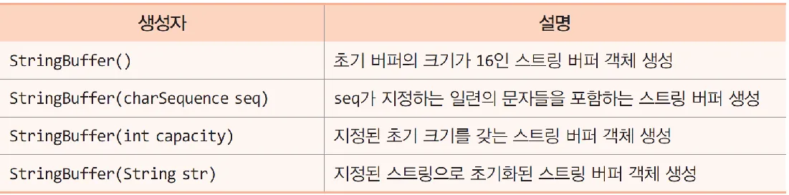
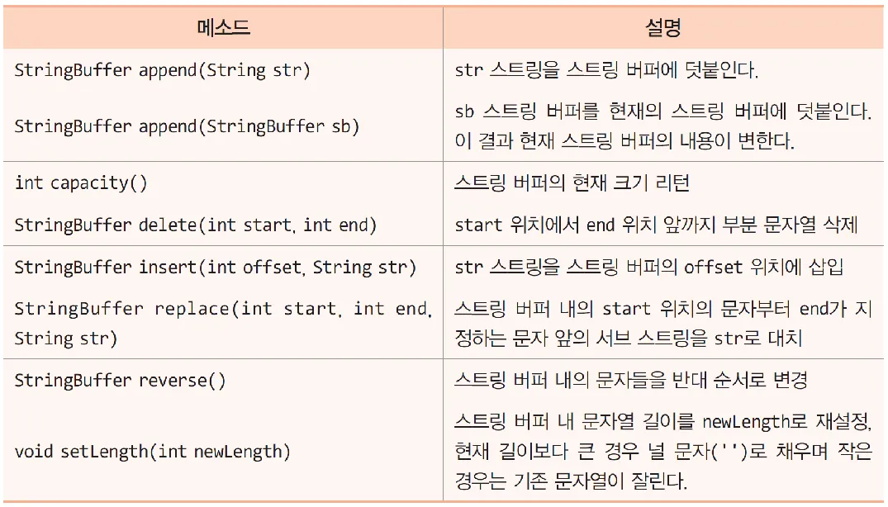
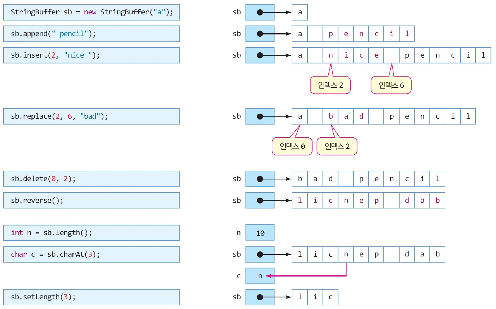

# 014_StringBuffer
### { 개념 }

- StringBuffer란?문자열을 추가하거나 변경할 때 주로 사용하는 자료형이다
- String 클래스와 달리 문자열 변경이 가능하다
- Java.lang.StringBuffer
- StringBuffer 객체의 크기는 문자열 길이에 따라 가변적으로 생성된다.
- 생성
```
StringBuffer sb = new StringBuffer("java");
sb.append("hello");
sb.append(" ");
sb.append("jump to java");
String result = sb.toString();
System.out.println(result);  // "javahello jump to java" 출력
```
### { 생성자 }


### { 주요메소드 }




```
public class StringBufferEx{
	public static void main(String[] args){
			//Stringbuffer sb를 생성해 This를 넣는다. 길이는 16
			StringBuffer sb = new StringBuffer("This");
			//This 뒤에 is pencil 덧붙인다. 
			sb.append(" is pencil"); //This is pencil (뒤에 is pencil 문자열 덧붙이기)
			//This is pencil 출력 
			System.out.println(sb);
			//7번째 자리뒤에 my를 삽입한다. 
			sb.insert(7," my"); //7번째 자리뒤에 my 문자열 삽입 
			//This is my pencil 출력 
			System.out.println(sb);
			//8부터 10 자리인 my를 your로 대체
			sb.replace(8,10,"your"); //"my"를 "your"로 변경 
			//This is your pencil 출력 
			System.out.println(sb);
			//your 삭제 
			sb.delete(8,13); //"your" 삭제 
			//This is pencil 출력 
			System.out.println(sb);
			//sb의 길이를 16 -> 4로 변경 
			sb.setLength(4); //스트링 버퍼 내 문자열 길이 수정 
			//This 출력 
			System.out.println(sb); //sb.toString()으로 자동 바뀜 
			//This Hello jump to java
			sb.append(" Hello jump to java");
			//this까지 
			System.out.println(sb.substring(0, 4));
	}
}
/* 출력결과 
This is pencil
This is my pencil
This is your pencil
This is pencil
This

*/
```